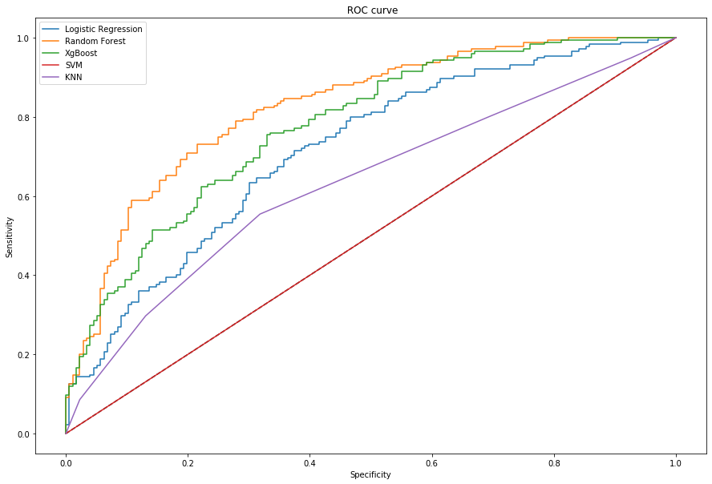
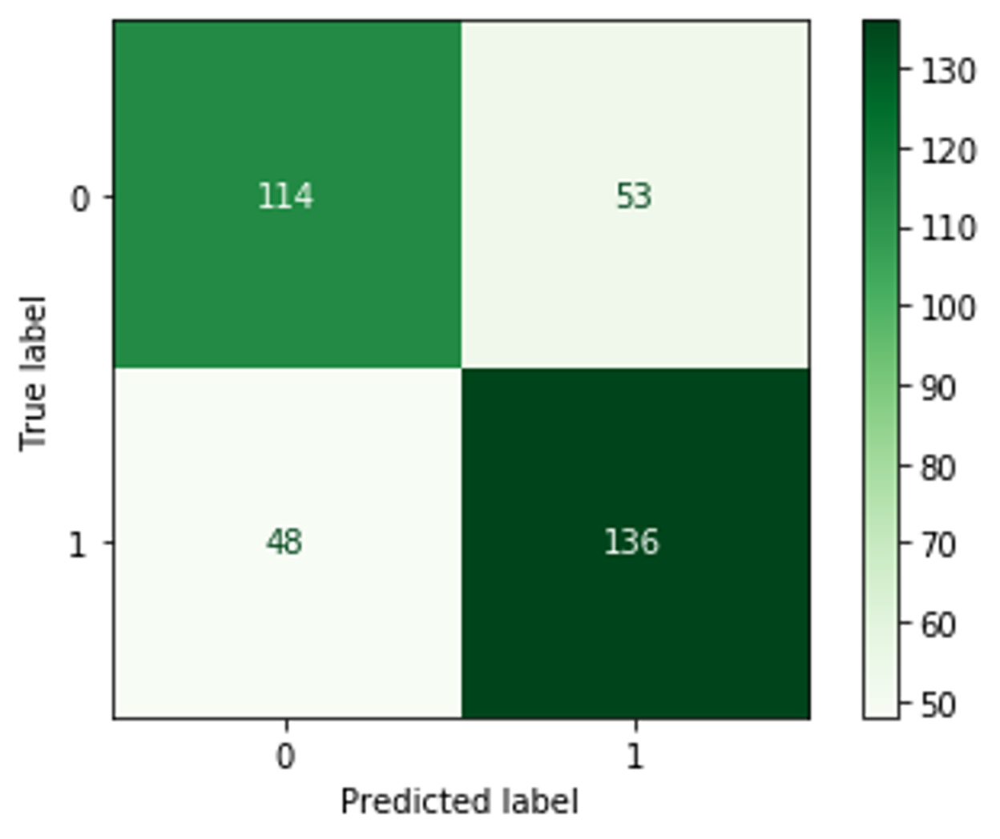
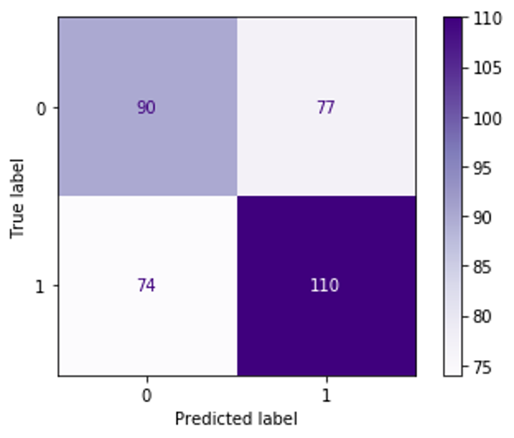
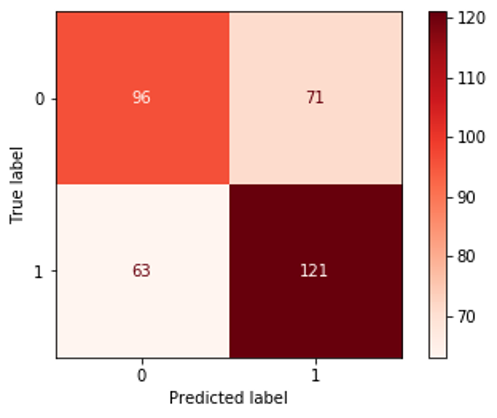

# March-Data-Crunch-Madness
## Executive Summary
In this project, the goal is to use machine learning models to predict the probabilities of team1 winning over team2 in men’s NCAA tournament and use the probability to further analyze upsets in 2020 season

To better utilize the data, the missing values have been filled out respectively, the categorical variables have been transferred to dummy variables and some meaningless variables have been dropped out

Five machine learning models have been used: logistic regression, random forest, extreme gradient boosting , support vector machine, and K-Nearest Neighbors. In order to evaluate the model performance, the log loss and accuracy have been computed

Finally, after hyper-parameters turning, random forest as the best performed model has been used to do further analysis. Accordingly, we used probability to find the potential dark horses and underlying upsets

## Results and Evaluation

## Confusion Matrix
Random Forest

Logistic Regression

XGBoost

 KNN

 SVM
